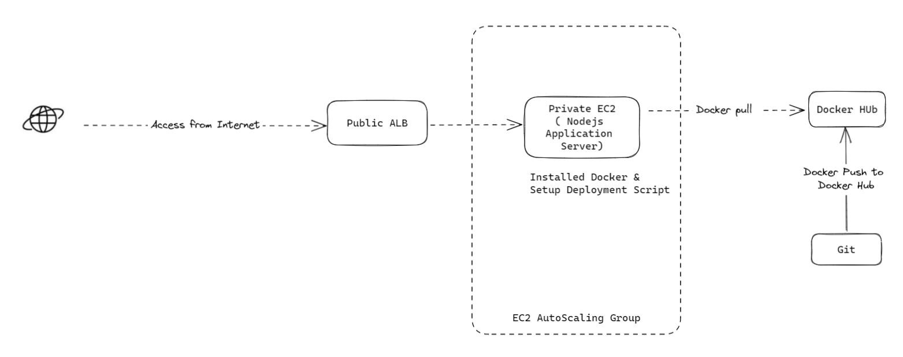

## Node.js application into a Docker container and setup with Autoscaling

### Here's the simple diagram to setup the project

## Task Lists

- Create Dockerfile to run Node.js simple application
- Build your image and push to dockerhub

- Utilize Terraform to provision infrastructure components, including:
    - Related VPC
    - EC2 instances for running the Node.js application.
    - Autoscaling Group to manage the scalability of the deployed instances.
    - Security groups and IAM roles for necessary permissions.
    - Application Load Balancer to distribute traffic.

- Implementing a continuous integration and delivery (CI/CD) pipeline, This could include setting up automated building and deploying docker image  ( using gitlab or github actions or aws code pipeline , whatever )
- setup domain & ssl on Public Application Loadbalancer 

Remark 
> Make sure the application loadbalancer is reachable from the public internet

> Make sure the Nodejs Server within Autoscaling Group is not reachable from the public internet.

